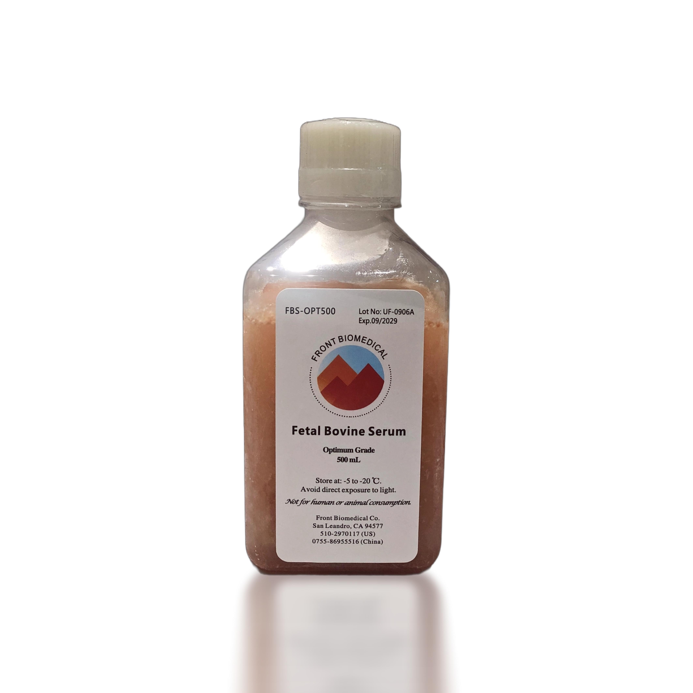
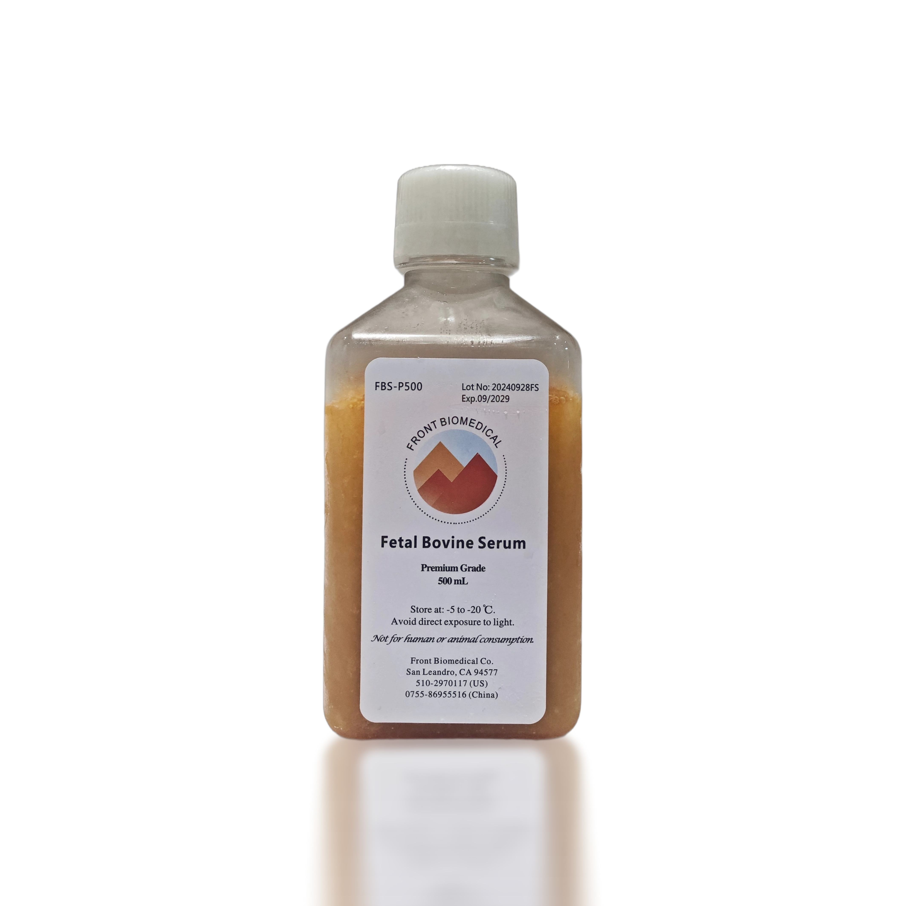
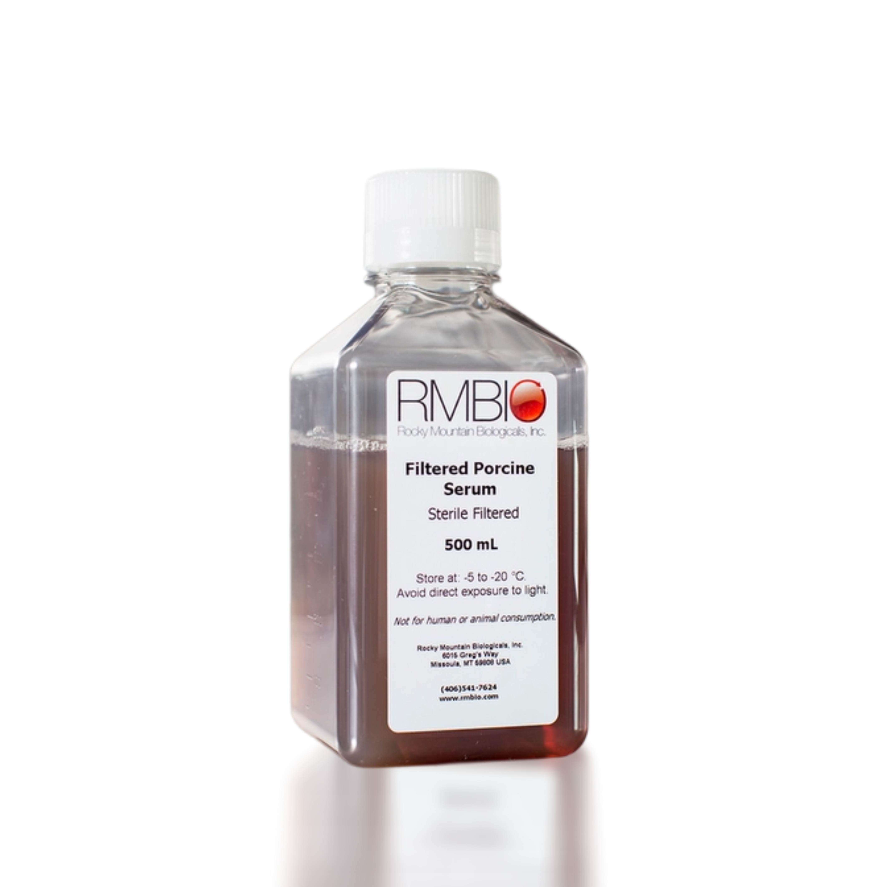
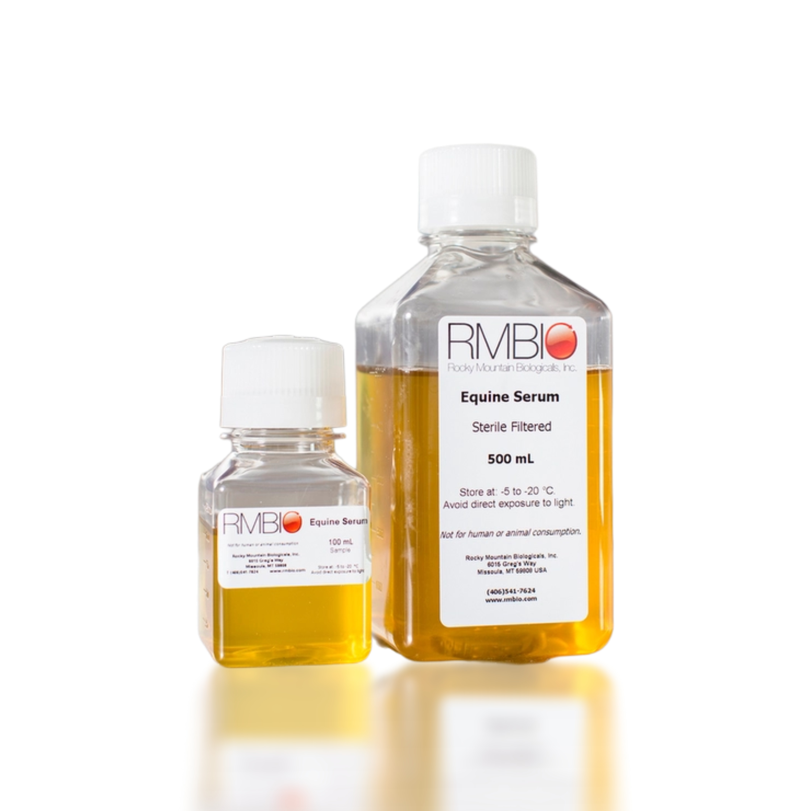
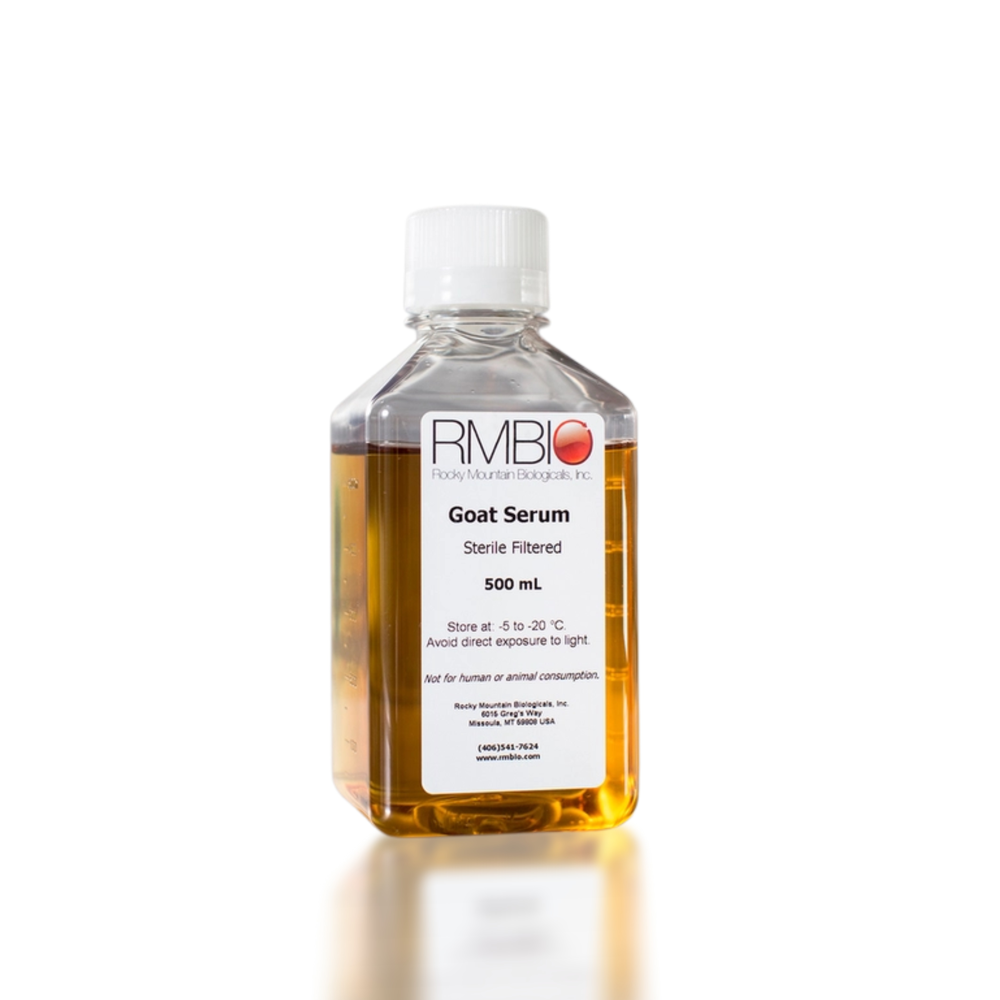

						
							
  <!-- align-items-start 保证顶部对齐 -->
										<!-- 图片部分 -->
										

											
										

										<!-- 文字内容部分 -->
										

											
<a href="Front-Biomed-Superior-Grade-Fetal-Bovine-Serum.php" style="hover: #FF8500;">Front Biomed特级国产胎牛血清 (FBS, Optimum)</a>

											

												<!-- 按钮部分 -->
												<button class="site-button orange radius-xl m-r15" type="button" style="padding: 5px 15px; font-size: 14px;">概述</button>
												
												<!-- 文字部分 -->
												
Front Biomed特级国产胎牛血清，原材料甄选于国内特级牧场：牧草肥美，生态环境优美，完全无污染，严格筛选的顶级胎牛原料，各项血清指标都达到或超过国际最高标准；以Front确认的工艺标准生产加工、经弗劳恩质量体系检测的esc级别胎牛血清。该款胎牛血清已经成为国内许多重点实验室的国产替代首选。

											

											

												<!-- 按钮部分 -->
												<button class="site-button orange radius-xl m-r15" type="button" style="padding: 5px 15px; font-size: 14px;">规格</button>
												
												<!-- 文字部分 -->
												<button class="site-button bg-primary gradient m-r15 sharp-md" style="margin-left: 20px; padding: 5px 20px; font-size: 14px;" type="button">500mL</button>
											

										

									

									

										
  <!-- align-items-start 保证顶部对齐 -->
											<!-- 图片部分 -->
											

												
											

											<!-- 文字内容部分 -->
											

												
<a href="Front-Biomed-Premium-FBS.php" style="hover: #FF8500;">Front Biomed优级胎牛血清 (FBS, Premium)</a>

												

													<!-- 按钮部分 -->
													<button class="site-button orange radius-xl m-r15" type="button" style="padding: 5px 15px; font-size: 14px;">概述</button>
													
													<!-- 文字部分 -->
													
Front Biomed优级胎牛血清采用经过严格筛选的最优质的新西兰或国产胎牛血清。其采集方法，加工过程，检定标准与美国原产优等胎牛血清完全一致。经过3次100 nm过滤，其质量相当或优于Gibco南美/依科赛南美等同类产品。

												

												

													<!-- 按钮部分 -->
													<button class="site-button orange radius-xl m-r15" type="button" style="padding: 5px 15px; font-size: 14px;">规格</button>
													
													<!-- 文字部分 -->
													<button class="site-button bg-primary gradient m-r15 sharp-md" style="margin-left: 20px; padding: 5px 20px; font-size: 14px;" type="button">500mL</button>
												

											

										

									

								
								

									
  <!-- align-items-start 保证顶部对齐 -->
										<!-- 图片部分 -->
										

											
										

										<!-- 文字内容部分 -->
										

											
<a href="Pig-Serum.php" style="hover: #FF8500;">猪血清(Pig Serum-Porcine Serum)</a>

											

												<!-- 按钮部分 -->
												<button class="site-button orange radius-xl m-r15" type="button" style="padding: 5px 15px; font-size: 14px;">概述</button>
												
												<!-- 文字部分 -->
												
作为少数天然猪血清供应商之一，Front的猪血清源自美国农场。Front从未用抗生素或激素处理的动物收集和生产猪血清。这种独特的猪血清用作细胞培养基特别是疫苗生产中非常理想。有机猪血清经过200nm无菌过滤，具有低血红蛋白水平.猪血清非常适合用于疫苗生产以及细胞培养。

											

											

												<!-- 按钮部分 -->
												<button class="site-button orange radius-xl m-r15" type="button" style="padding: 5px 15px; font-size: 14px;">规格</button>
												
												<!-- 文字部分 -->
												<button class="site-button bg-primary gradient m-r15 sharp-md" style="margin-left: 20px; padding: 5px 20px; font-size: 14px;" type="button">500mL</button>
												<button class="site-button bg-primary gradient m-r15 sharp-md" style="padding: 5px 20px; font-size: 14px;" type="button">1L</button>
												<button class="site-button bg-primary gradient m-r15 sharp-md" style="padding: 5px 20px; font-size: 14px;" type="button">3.5L</button>
											

										

									

								

								
								
								

									
  <!-- align-items-start 保证顶部对齐 -->
										<!-- 图片部分 -->
										

											
										

										<!-- 文字内容部分 -->
										

											
<a href="Horse-Serum.php" style="hover: #FF8500;">马血清(Horse Serum-Porcine Serum)</a>

											

												<!-- 按钮部分 -->
												<button class="site-button orange radius-xl m-r15" type="button" style="padding: 5px 15px; font-size: 14px;">概述</button>
												
												<!-- 文字部分 -->
												
Front的供体马血清是采自中国、美国、澳洲或新西兰，有兽医定期检查及监控的牛群。马血清非常适合用作细胞培养基和兽医生物制品。

											

											

												<!-- 按钮部分 -->
												<button class="site-button orange radius-xl m-r15" type="button" style="padding: 5px 15px; font-size: 14px;">规格</button>
												
												<!-- 文字部分 -->
												<button class="site-button bg-primary gradient m-r15 sharp-md" style="margin-left: 20px; padding: 5px 20px; font-size: 14px;" type="button">500mL</button>
												<button class="site-button bg-primary gradient m-r15 sharp-md" style="padding: 5px 20px; font-size: 14px;" type="button">1L</button>
												<button class="site-button bg-primary gradient m-r15 sharp-md" style="padding: 5px 20px; font-size: 14px;" type="button">3.5L</button>
											

										

									

								

								
  <!-- align-items-start 保证顶部对齐 -->
										<!-- 图片部分 -->
										
 
											
										

										<!-- 文字内容部分 -->
										

											
<a href="Front-Biomed-Superior-Grade-Fetal-Bovine-Serum.php" style="hover: #FF8500;">羊血清(Sheep Serum-Porcine Serum)</a>

											

												<!-- 按钮部分 -->
												<button class="site-button orange radius-xl m-r15" type="button" style="padding: 5px 15px; font-size: 14px;">概述</button>
												
												<!-- 文字部分 -->
												
Front从严格监控的山羊群中，挑选健康成年羊为供体。我们收集山羊血清并将其过滤，得到的是高品质的高度一致的批次产品。

											

											

												<!-- 按钮部分 -->
												<button class="site-button orange radius-xl m-r15" type="button" style="padding: 5px 15px; font-size: 14px;">规格</button>
												
												<!-- 文字部分 -->
												<button class="site-button bg-primary gradient m-r15 sharp-md" style="margin-left: 20px; padding: 5px 20px; font-size: 14px;" type="button">500mL</button>
											

										

									

							
z